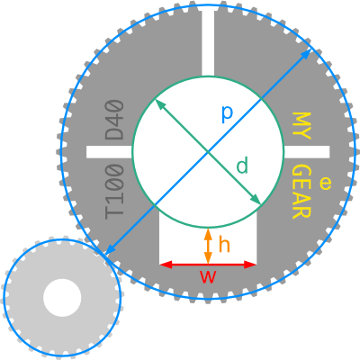
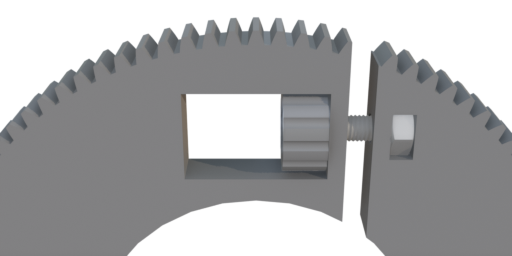
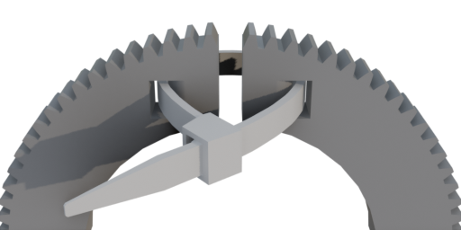

# Follow Focus Adapter
Fully parameterizable, 3D-printable gears for camera lens rings

## Description
This project provides OpenSCAD code to generate 3D files of gears which can be 3D-printed and clampled on camera (focus) rings with given diameter. These follow focus adapters support
- [Screw](#screw-fastener) or [cabletie](#cable-tie-fastener) fastener
- 360° rotation
- Focus tab

The gears have a module of 0.8 by default, which can be changed in the `adapter_*.scad` files.

## How to
1. Download [OpenSCAD](https://openscad.org/downloads.html) and this repository
1. Open [custom_parameters.scad](custom_parameters.scad) with OpenSCAD and enter the [parameters](#adapter-parameters) for your focus ring
1. Depending on your preferred [fastening method](#fastener-options), open
    - [adapter_cabletie.scad](adapter_cabletie.scad) or 
    - [adapter_screw.scad](adapter_screw.scad) and [screw_head.scad](screw_head.scad)
1. Go to `Design -> render` and then `File -> export -> STL` to generate the 3D-file

### Adapter parameters

- d = `focusringDiameter`: Diameter of your focus ring in mm
- w = `tabWidth`: When the focus ring has an focus tab, this is the width in mm. Otherwise set to 0
- h = `tabHeight`: When the focus ring has an focus tab, this is the height in mm. Otherwise set to 0
- p = `wantedPitchDiameter`: Optional minimum pitch diameter when a larger gear is preferred. Note that due to even number of teeth, the actual pitch diameter may be sightly larger. It will be shown in OpenSCAD when generating the adapter
- e = `engravingTextL1` and `engravingTextL1`: Optional custom engraving text. Note that the number of teeth (T) and the ring diameter (D) will always be engraved automatically too. That way, you can calculate the pitch diameter by 0.8 x T and the outer diameter by 0.8 x (T + 2)

## Fastener options
The adapter can be generated with a screw or cabletie fastener

### Screw fastener

Fastening with a screw has the advantage that the adapter can be easily fixated and loosened without additional tools.

Generate the 3D-files from [adapter_screw.scad](adapter_screw.scad) and [screw_head.scad](screw_head.scad).

Additionally, you will need
- an M3 x 10mm or 12mm hex cap screw (DIN 933 / ISO 4017) and 
- an M3 hex nut (DIN 934 / ISO 4030) or even better quad nut (DIN 562).

### Cable tie fastener

Fastening with a cable tie has the advantage that the adapters' outer diameter is smaller.

Generate the 3D-file from [adapter_cabletie.scad](adapter_cabletie.scad).